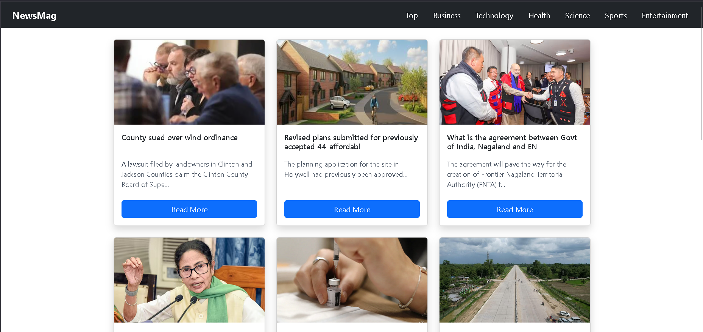

A frontend project showcasing API integration, reusable components, and clean UI design using React.

# 📰 NewsMag – React News Application

NewsMag is a modern, responsive news web application built using **React**.  
It fetches real-time news using **NewsAPI** and allows users to browse news across multiple categories with a clean and professional UI.

---

## 🚀 Features

- 📌 Category-based news (Technology, Business, Health, Science, Sports, Entertainment)
- 🇮🇳 India-focused news using optimized keyword-based search
- ⚡ Real-time news fetched from NewsAPI
- 🧩 Reusable React components
- 🖼️ Fallback image & description handling
- 📱 Fully responsive design
- 🎨 Clean, professional UI with custom colors

---

## 🛠️ Tech Stack

- **Frontend:** React, JavaScript  
- **Styling:** Bootstrap, CSS  
- **API:** NewsAPI  
- **Build Tool:** Vite  

---

## 📂 Project Structure

NEWSMAG/
│
├── src/
│ ├── assets/
│ │ └── news.jpg
│ │
│ ├── components/
│ │ ├── Navbar.jsx
│ │ ├── NewsBoard.jsx
│ │ └── NewsItem.jsx
│ │
│ ├── App.jsx
│ ├── main.jsx
│ ├── App.css
│ └── index.css
│
├── index.html
├── package.json
├── vite.config.js
└── README.md

## 🔑 Environment Variables 
Create a .env file in the root directory and add your NewsAPI key: 

VITE_API_KEY=your_api_key_here

Note: The .env file is excluded from version control for security reasons.

##📸Screenshots

